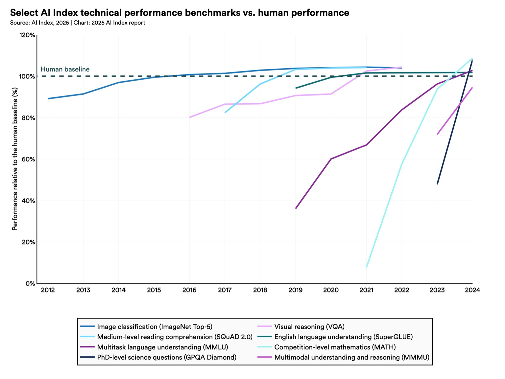

## Premise

Assume, for a moment,
- AI capabilities are still compounding exponentially
- Frontier models continue to become publicly accessible within months of training
- Competent generation is quickly becoming a commodity—cheap, ubiquitous, and undifferentiated. [^1]

ie: assume trends continue.

When out‑of‑the‑box competence is “good enough,” differentiation (even against rapidly vertically‑integrating model providers) shifts to what remains scarce: **Taste**.

## What Remains Defensible?

Anyone can call an LLM API and chain three prompts together. Anyone can create a really detailed, quickly leaked system prompt that drives user interactions.

What they *cannot* copy overnight is **knowing what good looks like in your domain**.

This is a much tricker question than it initially seems, because it's not enough to just know what's good—you have to truly, deeply understand what your customers want (including what they're not telling you, and would never tell you!), in every sense of the word.

What's not defensible is operationalizing the **precise definition of what exactly you want**.

At first glace, this doesn't seem that important. Everyone knows what they want! But defining it and **operationalizing it** is tricky.

The bits that are hard to copy:
- **Expert annotations**: data labeled by and conversations with experts (eg; for diagrams: senior architects) where you gain much more clarity about what exactly it is that you need to build.
- **Evaluator Craftsmanship**: the combination of rigor, expertise, and great engineering that lets you evaluate your outputs
- **Institutional Memory**: the implicit heuristics an organization develops by shipping many iterations and seeing what breaks in the real world
- **Systems Architecture**: the design that allows each of these levers is used to its fullest potential. (there is often much, much, MUCH more that you can get out of your data than you might realize)

Combining these, you create a compound asset that is worth much, much more than the sum of its parts: *Judgement Capital*—all the reusable assets that let you measure and enforce quality.

This grows slowly, resists leakage, and amortizes over every feature—actively used evaluators compound.

## The Decomposition Law (weak title)

Any complex pipeline is bottlenecked by its hardest atomic subtask.

For an AI pipeline in a less-easy-to-verify-domain, that subtask is often *evaluating the output*.

For example—say you created a validator with 80% accuracy with a simple "correctness" metric. This validator limits you to shipping only what you can prove meets that bar. There is room for LLM variance creating incredible results using your pipeline, but you will only stumble across "incredible"—never reliably distinguish, reproduce, or guarantee at scale. What you measure and the **reliability** with which you measure it is the critical bottleneck for improving your product—especially important for "ai-native" companies.

If all you check is correctness, or if you produce "good" or "good enough" outputs, you can never tell if you're producing "great", "incredible", or "superhuman" outputs—they all look the same.

## What You Measure, You Optimize

Benchmarks are saturating faster and faster. The fastest way to improve performance on a given domain is to measure it—and you cannot improve on what you cannot measure![^2]

Lately, LLMs have been exhibiting the marvelous property of autonomously being able to make numbers go up and tests go green—from CUDA kernels to tested software generation to DSPy's optimizers. Self improvement is possible when you constrain the domain well enough.

Verification gets you a LOT of benefits—it constrains the domain of valid solutions, it defines what exactly it is you care about and how much, **and it lets LLMs autonomously work on your pipelines**. You don't have to figure out how to generate superhuman outputs. (obviously, you do lmao, but fr, it's much less difficult than figuring out how to evaluate them reliably (OR GATHER ENOUGH GROUND TRUTH THAT WORKS TOO)

Both LLMs and LLM engineers are great at hillclimbing. By generating quality data and evaluating it properly, it becomes an OOM more straightforward to reach the Pareto Frontier at the intersection of the metrics you and your customers actually care about.

## RL

What do you get when you measure performance?

A lot of different benefits, with different levels of work. At the lowest-effort end of the spectrum, it lets you tell if a given output is good, because you now have things you're looking for, and when there's a corner case, you can reason about it easier and document it for the future.

With a little work, a calibrated scorer, and representative inputs, it lets you do things like optimizing prompt pipelines to excel on any chosen metric (accuracy, latency, you name it).

With a lot of work and a directionally correct scorer, it gives your model powerful reward signal when what you're looking for is so nuanced that even you cannot tell yourself. ex: in GRPO, the relative advantage in a group matter most—so even if you're not perfect, if instead of you, an LLM can judge, you can provide useful RL signal.

We seem to be on track in saturating progress in verifiable domains—this is almost a given now. The results of this hold when you're able to articulate what it is, exactly, you want, to a model that just wants to learn what it is you want! If you can define that coherently (minimal conflicts) and reliably, you provide excellent signal (in addition to the representative inputs you have collected for your data so far!) to train a model or an LLM system to become superhuman at your task.

Both LLM pipelines and RL training pipelines are (or can be) trained to optimize towards clearly defined objectives. The evaluators of these objectives are the what shapes the outcomes.

Say we wanted "superhuman" outcomes—these are very difficult to hand-design, because by definition, they exceed human capability. However, we **can** define, directionally, aspects of what that looks like, or at the very minimum, how to tell (or qualities that correlate with quality) in the pairwise case.

This insight makes creating incredible AI products much more straightforward and lets you work on the most important parts.

---

### A Brief Aside

This is _a_ path to building **the best** product in your field. An unimaginably, fucking incredible thing, whatever it is you want to make—one that really takes advantage of **superhuman** intelligence on tap.

Dude, the thing is, nobody knows what that will look like. Do you remember the best food you've ever had? Okay, so for me, they're mulitas, from this place called Tacos Maggie. And they're just so, so, so fucking incredibly good. Like you have not lived until you've tried their Tripas Mulitas. I search for better ones everywhere I go and all I find is dissapointment. Heaven on earth, this truck is an absolute pillar of the community.

Much in the same way—it is very, very possible to create incredible experiences with the things it is you're building. Like what does the best doctor's visit you've ever had look like? What about a technical diagram that so effectively conveys what matters that people understand exactly the most important parts right away, and **everyone converges on the same ideas within moments of looking at it**?

The point is, there are so many possibilities here. We really don't know what superhuman looks like at the things that your company is an expert on. Wouldn't you want to know?

---

## But We're Good Enough

If you, by hand, can reliably tell what's good enough, then why invest in any infra or thinking about this problem at all?

As soon as you scale or aim higher, the uncertainty about the performance of your pipeline makes improving it possible. It makes incredible results for your users a rare, sporadic occurence, as opposed to engineering reliable moments of surprise and delight.

And it really, really is trivial to get started. Pick the things you vibe-test on. Make it formal. Write up a prompt that gets you >=50%. You then have something to improve, which is much, much, much better than nothing, and the first path towards **reliable**, incredible AI products that are incredibly hard to replicate. [^3]

## An Engine of Discovery

The AI companies that create incredible products will be those who reliably define, measure, and optimize towards excellence.

I hope this is obvious. The best teams do this already. They've always done this. It's just a little harder now, but is just as important a philosophy to hold.

AI engineering is… normal engineering, just with less reliable systems we're working with. But making them reliable is an engineering challenge that unlocks a lot of the benefits of AI that we've been promised and have had hyped up but haven't seen.

This is a tricky, hard problem that is incredibly rewarding to make progress on and do right. And it's really simple to start :)

#### Some Examples

openai, anthropic (constitiutional AI), midjourney (their moat is literally the taste of their platform it is clearly very difficult to make a better midjourney)
